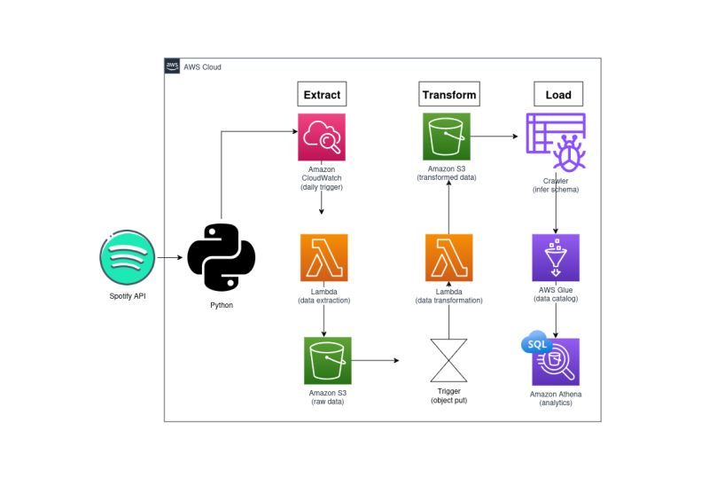

# Spotify Data Pipeline on AWS

This repository contains an end-to-end **Data Engineering Project** that extracts Spotify data using the Spotify Web API, transforms it using AWS Lambda, stores it in Amazon S3, and enables SQL-based analytics using AWS Glue and Amazon Athena.

This project demonstrates how to build a **serverless ETL pipeline** on AWS using Python and cloud-native services.

---

## 🏗️ Project Architecture

<p align="center">
  
</p>

---

## 🚀 Technologies Used

- Python
- Spotify Web API
- AWS Lambda
- Amazon EventBridge
- Amazon S3
- AWS Glue
- Amazon Athena
- AWS IAM
- Amazon CloudWatch
- Pandas
- Boto3

---

## 📌 Features

- Extracts playlist data from the Spotify API.
- Stores raw JSON data in Amazon S3.
- Automatically transforms raw data into analytics-ready datasets.
- Creates separate datasets for:
  - Songs
  - Albums
  - Artists
- Uses AWS Glue Crawlers to automatically infer schemas.
- Queries transformed data directly from Amazon Athena.
- Fully automated serverless ETL pipeline using AWS services.

---

## 📂 Project Structure

```text
spotify-data-pipeline/
│
├── lambda/
│   ├── spotify_api_data_extract.py
│   └── spotify_transformation.py
│
├── notebooks/
│
├── screenshots/
│
├── README.md
│
└── requirements.txt
```

---

## 📁 Data Lake Structure

```text
raw_data/
│
└── to_processed/
    └── *.json

transformed_data/
│
├── song_data/
├── album_data/
└── artist_data/
```

---

## ⚙️ Pipeline Workflow

### 1️⃣ Data Extraction

- Connects to the Spotify Web API.
- Fetches playlist metadata.
- Stores raw JSON files in Amazon S3.

---

### 2️⃣ Data Transformation

AWS Lambda transforms the raw JSON into structured datasets:

- Song Data
- Album Data
- Artist Data

The transformed files are stored back in Amazon S3.

---

### 3️⃣ Data Cataloging

AWS Glue Crawlers scan the transformed data stored in S3 and create tables in the AWS Glue Data Catalog.

---

### 4️⃣ Data Analytics

Amazon Athena is used to query the datasets directly from S3 using SQL.

Example:

```sql
SELECT *
FROM song_data
LIMIT 10;
```

---

## ☁️ AWS Services Used

- AWS Lambda
- Amazon S3
- Amazon EventBridge
- AWS Glue
- Amazon Athena
- AWS IAM
- Amazon CloudWatch

---

## 📚 Skills Demonstrated

- Building Serverless ETL Pipelines
- REST API Integration
- Data Transformation with Pandas
- AWS Lambda Development
- Event-Driven Architecture
- Data Lake Design using Amazon S3
- AWS Glue Crawlers & Data Catalog
- SQL Analytics with Amazon Athena
- IAM Roles & Permissions Management

---

## 🔮 Future Improvements

- Store transformed data in Parquet format.
- Partition datasets for faster Athena queries.
- Add data validation before transformation.
- Orchestrate the pipeline using AWS Step Functions.
- Build dashboards using Amazon QuickSight.

---

## 📖 References

This project was inspired by the **Python for Data Engineering** course by **Darshil Parmar**. The implementation, deployment, debugging, and AWS configuration were completed independently as part of hands-on learning.

---

## ⭐ If you found this project useful, consider giving it a star!
